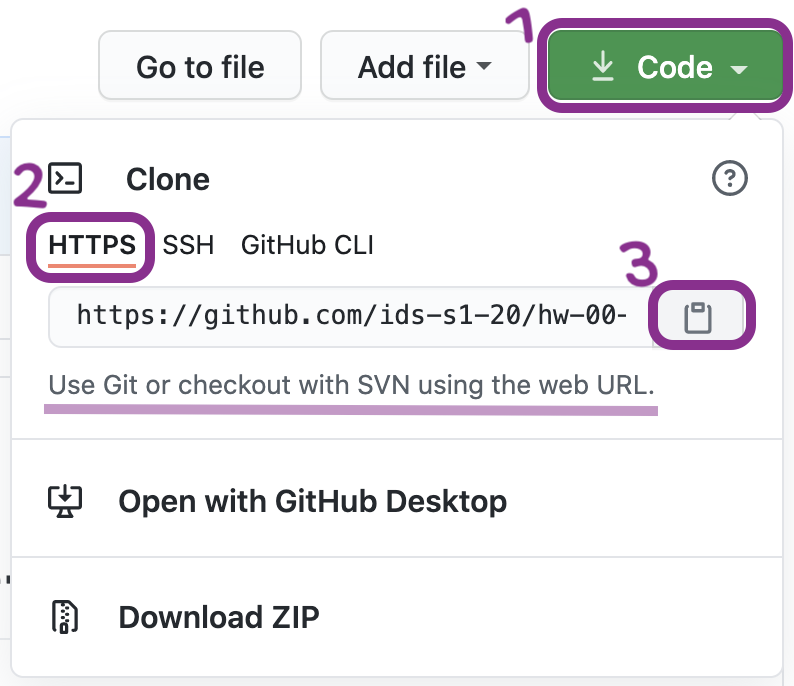
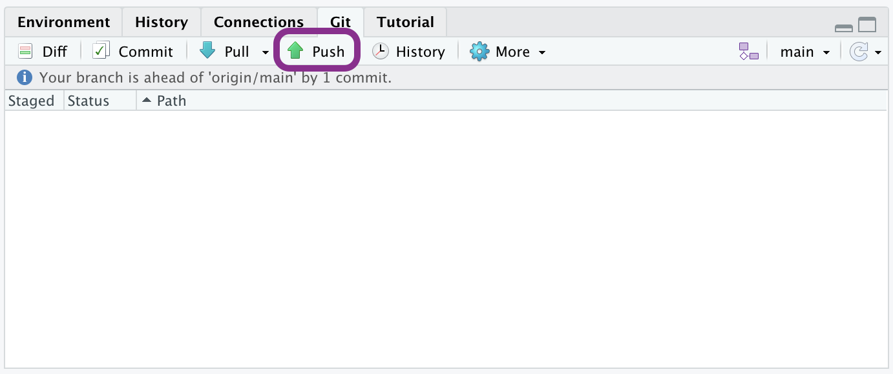

HW 01 - Pet names
================

**This assignment has been adapted from [HW 01- Pet
Names](https://datasciencebox.org/course-materials/hw-instructions/hw-01/hw-01-pet-names.html)
on [Data Science in a Box](https://datasciencebox.org/).**

<hr>

The goal of this assignment is to introduce you to R, RStudio, Git, and
GitHub, which you’ll be using throughout the course both to learn the
data science concepts discussed in the course and to analyze real data
and come to informed conclusions.

# Getting started

## Terminology

We’ve already thrown around a few new terms, so let’s define them before
we proceed.

-   **R:** Name of the programming language we will be using throughout
    the course.

-   **RStudio:** An integrated development environment for R. In other
    words, a convenient interface for writing and running R code.

-   **Git:** A version control system.

-   **GitHub:** A web platform for hosting version controlled files and
    facilitating collaboration among users.

-   **Repository:** A Git repository contains all of your project’s
    files and stores each file’s revision history. It’s common to refer
    to a repository as a repo.

    -   In this course, each assignment you work on will be contained in
        a Git repo.
    -   For individual assignments, only you will have access to the
        repo. For team assignments, all team members will have access to
        a single repo where they work collaboratively.
    -   All repos associated with this course are housed in the course
        GitHub organization. The organization is set up such that
        students can only see repos they have access to, but the course
        staff can see all of them.

# Workflow

<div>

> **Important**
>
> If there is no GitHub repo created for you for this assignment, it
> means I didn’t have your GitHub username as of when I assigned the
> homework. Please let me know your GitHub username asap, and I can
> create your repo.

</div>

For each assignment in this course you will start with a GitHub repo
that I created for you and that contains the starter documents you will
build upon when working on your assignment. The first step is always to
bring these files into RStudio so that you can edit them, run them, view
your results, and interpret them. This action is called **cloning**.

Then you will work in RStudio on the data analysis, making **commits**
along the way (snapshots of your changes) and finally **push** all your
work back to GitHub.

The next few steps will walk you through the process of getting
information of the repo to be cloned, cloning your repo in a new RStudio
Cloud project, and getting started with the analysis.

### Step 1. Get URL of repo to be cloned



On GitHub, click on the green **Code** button, select **HTTPS** (this
might already be selected by default, and if it is, you’ll see the text
*Use Git or checkout with SVN using the web URL* as in the image on the
right). Click on the clipboard icon 📋 to copy the repo URL.

### Step 2. Go to RStudio Cloud + Clone the repo

Go to the RStudio Cloud workspace for the course
([rstd.io/teach-ds-conf22-cloud](https://rstd.io/teach-ds-conf22-cloud)).
In RStudio, click on the **down arrow** next to New Project and then
choose **New Project from Git Repository**.

In the pop-up window, **paste the URL** you copied from GitHub, make
sure the box for **Add packages from the base project** is checked (it
should be, by default) and then click **OK**.


# Hello Git!

Before we can get started we need to take care of some required
housekeeping. Specifically, we need to do some configuration so that
RStudio can communicate with GitHub.  

## Set up Personal Access Token

Set a Personal Access Token (PAT) that serves as an authentication
between RStudio Cloud and your GitHub account. To get the token:

-   Run the following code in the **console**:

``` r
usethis::create_github_token()
```

This will take you to github.com. The “repo”, “user”, and “workflow”
permissions will be checked if you used `create_github_token()`.

-   Click “Generate token” and copy the PAT.

To save the token in RStudio Cloud, run the following code in the
**console**:

``` r
gitcreds::gitcreds_set()
```

Then, paste the PAT when prompted.

## Configure git

Now that we’ve authenticated, we need to do some configuration so that
RStudio can communicate with GitHub. This requires two pieces of
information: the email address associated with your GitHub account name.

Run the following (but update it for your name and email!) in the
**console** to configure git:

``` r
use_git_config(user.name = "Your Name", 
               user.email = "your.email@address.com")
```

# Warm up

<div>

> **Note**
>
> The top portion of your Quarto file (between the three dashed lines)
> is called \*\*YAML\*\*. It stands for “YAML Ain’t Markup Language”. It
> is a human friendly data serialization standard for all programming
> languages. All you need to know is that this area is called the YAML
> (we will refer to it as such) and that it contains meta information
> about your document.

</div>

## Step 1. Update the YAML

Open the Quarto (Qmd) file in your project, change the author name to
your name, and render the document.


## Step 2: Commit

Then Go to the **Git pane** in your RStudio.

You should see that your Qmd (Quarto) file and its output, your PDF file
, are listed there as recently changed files.

Next, click on **Diff**. This will pop open a new window that shows you
the **diff**erence between the last committed state of the document and
its current state that includes your changes. If you’re happy with these
changes, click on the checkboxes of all files in the list, and type
*“Update author name”* in the **Commit message** box and hit **Commit**.


You don’t have to commit after every change, this would get quite
cumbersome. You should consider committing states that are *meaningful
to you* for inspection, comparison, or restoration. In the first few
assignments we will tell you exactly when to commit and in some cases,
what commit message to use. As the semester progresses we will let you
make these decisions.

## Step 3. Push

Now that you have made an update and committed this change, it’s time to
push these changes to the web! Or more specifically, to your repo on
GitHub. Why? So that others can see your changes. And by others, we mean
the course teaching team (your repos in this course are private to you
and us, only). In order to push your changes to GitHub, click on
**Push**.



This will prompt a dialogue box where you first need to enter your user
name, and then your password. This might feel cumbersome. Bear with me…
I *will* teach you how to save your password so you don’t have to enter
it every time. But for this one assignment you’ll have to manually enter
each time you push in order to gain some experience with it.

**Thought exercise:** Which of the above steps (updating the YAML,
committing, and pushing) needs to talk to GitHub?[^1]

# Packages

R is an open-source language, and developers contribute functionality to
R via packages. In this assignment we will use the following packages:

-   **tidyverse**: a collection of packages for doing data analysis in a
    “tidy” way
-   **openintro**: a package that contains the datasets from OpenIntro
    resources

We use the `library()` function to load packages. In your Quarto
document you should see an R chunk labelled `load-packages` which has
the necessary code for loading both packages. You should also load these
packages in your Console, which you can do by sending the code to your
Console by clicking on the **Run Current Chunk** icon (green arrow
pointing right icon).


Note that these packages also get loaded in your Quarto environment when
you **Render** your Quarto document.

# Data

The city of [Seattle, WA](https://en.wikipedia.org/wiki/Seattle) has an
open data portal that includes pets registered in the city. For each
registered pet, we have information on the pet’s name and species. The
data used in this exercise can be found in the **openintro** package,
and it’s called `seattlepets`. Since the dataset is distributed with the
package, we don’t need to load it separately; it becomes available to us
when we load the package.

You can view the dataset as a spreadsheet using the `View()` function.
Note that you should not put this function in your Quarto document, but
instead type it directly in the Console, as it pops open a new window
(and the concept of popping open a window in a static document doesn’t
really make sense…). When you run this in the console, you’ll see the
following **data viewer** window pop up.

``` r
View(seattlepets)
```


You can find out more about the dataset by inspecting its documentation
(which contains a **data dictionary**, name of each variable and its
description), which you can access by running `?seattlepets` in the
Console or using the Help menu in RStudio to search for `seattlepets`.

# Exercises

1.  According to the data dictionary, how many pets are included in this
    dataset?

🧶 ✅ ⬆️ *Write your answer in your Quarto document under Exercise 1,
render the document, commit your changes with a commit message that says
“Completed Exercise 1”, and push. Make sure to commit and push all
changed files so that your Git pane is cleared up afterwards.*

2.  Again, according to the data dictionary, how many variables do we
    have for each pet?

🧶 ✅ ⬆️ *Write your answer in your Quarto document under Exercise 2,
render the document, commit your changes with a commit message that says
“Completed Exercise 2”, and push. Make sure to commit and push all
changed files so that your Git pane is cleared up afterwards.*

3.  What are the three most common pet names in Seattle? To do this you
    will need to count the frequencies of each pet name and display the
    results in descending order of frequency so that you can easily see
    the top three most popular names. The following code does exactly
    that.

``` marginfigure
The two lines of code can be read as "Start with the seattlepets data frame, and then count the animal_names, and display the results sorted in descending order. The 'and then' in the previous sentence maps to %>%, the pipe operator, which takes what comes before it and plugs it in as the first argument of the function that comes after it."
```

``` r
seattlepets %>%
  count(animal_name, sort = TRUE)
```

🧶 ✅ ⬆️ *Write your answer in your Quarto document under Exercise 3. In
this exercise you will not only provide a written answer but also
include some code and output. You should insert the code in the code
chunk provided for you, render the document to see the output, and then
write your narrative for the answer based on the output of this
function, and render again to see your narrative, code, and output in
the resulting document. Then, commit your changes with a commit message
that says “Completed Exercise 3”, and push. Make sure to commit and push
all changed files so that your Git pane is cleared up afterwards.*

Let’s also look to see what the most common pet names are for various
species. For this we need to first `group_by()` the `species`, and then
do the same counting we did before.

``` marginfigure
Looks like many of those NAs were cats. Poor unnamed kitties…
```

``` r
seattlepets %>% 
  group_by(species) %>%
  count(animal_name, sort = TRUE)
```

    # A tibble: 16,823 × 3
    # Groups:   species [4]
       species animal_name     n
       <chr>   <chr>       <int>
     1 Cat     <NA>          406
     2 Dog     Lucy          337
     3 Dog     Charlie       306
     4 Dog     Bella         249
     5 Dog     Luna          244
     6 Dog     Daisy         221
     7 Dog     Cooper        189
     8 Dog     Lola          187
     9 Dog     Max           186
    10 Dog     Molly         186
    # … with 16,813 more rows

But this output isn’t exactly what we wanted. We wanted to know the most
common cat and dog names, but there are barely any cats present in this
output! This is because there are more dogs than cats in the dataset
overall. We can confirm this by counting the various species in the
data.

``` marginfigure
6 pigs in the city? Ok… But we'll continue with cats and dogs.
```

``` r
seattlepets %>%
  count(species, sort = TRUE)
```

    # A tibble: 4 × 2
      species     n
      <chr>   <int>
    1 Dog     35181
    2 Cat     17294
    3 Goat       38
    4 Pig         6

Let’s search for the top 5 cat and dog names. To do this, we can use the
`slice_max()` function. The first argument in the function is the
variable we want to select the highest values of, which is `n`. The
second argument is the number of rows to select, which is `n = 5` for
the top 5. It may be a bit confusing that both of these are `n`, but
this is because we already have a variable called `n` in the data frame.

``` r
seattlepets %>% 
  group_by(species) %>%
  count(animal_name, sort = TRUE) %>% 
  slice_max(n, n = 5)
```

    # A tibble: 53 × 3
    # Groups:   species [4]
       species animal_name     n
       <chr>   <chr>       <int>
     1 Cat     <NA>          406
     2 Cat     Luna          111
     3 Cat     Lucy          102
     4 Cat     Lily           86
     5 Cat     Max            83
     6 Dog     Lucy          337
     7 Dog     Charlie       306
     8 Dog     Bella         249
     9 Dog     Luna          244
    10 Dog     Daisy         221
    # … with 43 more rows

4.  Based on the previous output we can easily identify the most common
    cat and dog names in Seattle, but the output is sorted by `n` (the
    frequencies) as opposed to being organized by the `species`. Build
    on the pipeline to arrange the results so that they’re arranged by
    `species` first, and then `n`. This means you will need to add one
    more step to the pipeline, and you have two options:
    `arrange(species, n)` or `arrange(n, species)`. You should try both
    and decide which one organizes the output by species and then ranks
    the names in order of frequency for each species.

🧶 ✅ ⬆️ *Write your answer in your Quarto document under Exercise 4. In
this exercise you’re asked to complete the code provided for you. You
should insert the code in the code chunk provided for you, render the
document to see the output, and then write your narrative for the answer
based on the output of this function, and render again to see your
narrative, code, and output in the resulting document. Then, commit your
changes with a commit message that says “Completed Exercise 4”, and
push. Make sure to commit and push all changed files so that your Git
pane is cleared up afterwards.*

The following visualization plots the proportion of dogs with a given
name versus the proportion of cats with the same name. The 20 most
common cat and dog names are displayed. The diagonal line on the plot is
the $x = y$ line; if a name appeared on this line, the name’s popularity
would be exactly the same for dogs and cats.


5.  What names are more common for cats than dogs? The ones above the
    line or the ones below the line?
6.  Is the relationship between the two variables (proportion of cats
    with a given name and proportion of dogs with a given name) positive
    or negative? What does this mean in context of the data?

🧶 ✅ ⬆️ *Now is a good time to commit and push your changes to GitHub
with an appropriate commit message. Commit and push all changed files so
that your Git pane is cleared up afterwards. Make sure that your last
push to the repo comes before the deadline. You should confirm that what
you committed and pushed are indeed in your repo that we will see by
visiting your repo on GitHub.*

[^1]: Only pushing requires talking to GitHub, this is why you’re asked
    for your password at that point.
